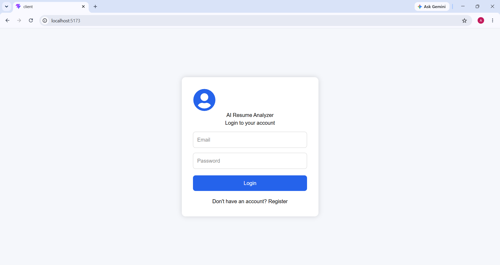
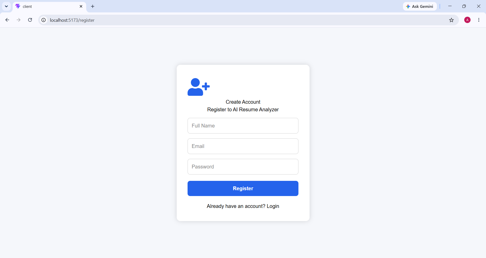
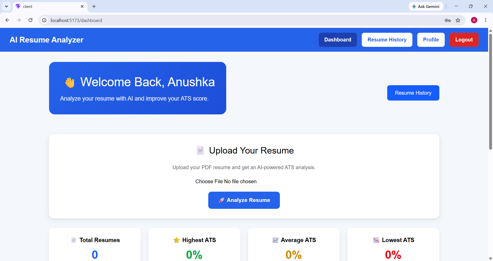
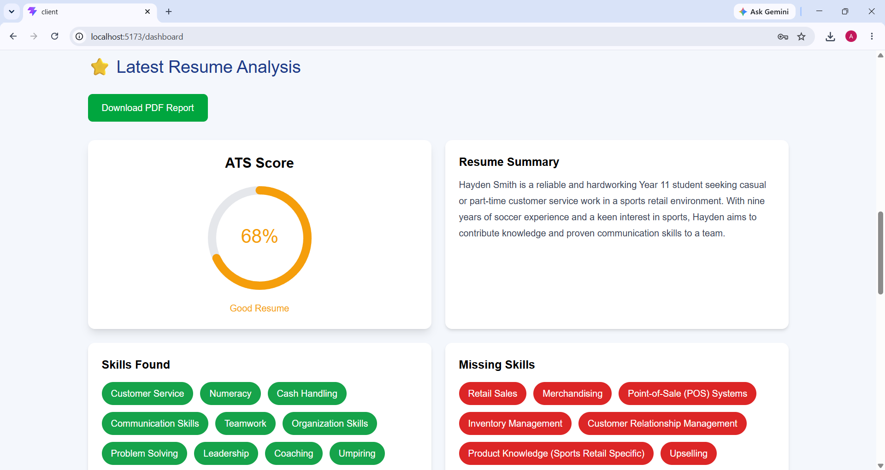
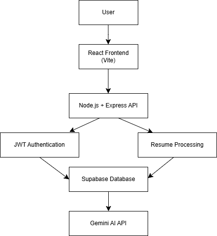

# AI Resume Analyzer 🚀

An AI-powered Resume Analyzer that analyzes resumes and provides ATS score, skills analysis, strengths, weaknesses and improvement suggestions using Artificial Intelligence.

## Features

- Resume Upload (PDF)
- AI Resume Analysis
- ATS Score Prediction
- Skill Extraction
- Strength Analysis
- Weakness Detection
- AI Suggestions
- User Authentication
- Resume History
- Download Report

## Tech Stack

### Frontend
- React.js
- Vite
- CSS
- Axios

### Backend
- Node.js
- Express.js
- JWT Authentication
- Multer

### Database
- Supabase

### AI
- Google Gemini AI


## Project Structure

```
AI-Resume-Analyzer

├── client
│   ├── src
│   ├── components
│   ├── pages
│   └── services
│
└── server
    ├── controllers
    ├── routes
    ├── middleware
    ├── services
    └── config
```


## Installation

Clone the repository:

```
git clone https://github.com/anushka-malkar/AI-Resume-Analyzer.git
```


## Frontend Setup

```
cd client
```

Install dependencies:

```
npm install
```

Run:

```
npm run dev
```


## Backend Setup

Open another terminal:

```
cd server
```

Install dependencies:

```
npm install
```

Run:

```
npm run dev
```


## Environment Variables

Create `.env` inside server folder:

```
SUPABASE_URL=
SUPABASE_KEY=
JWT_SECRET=
GEMINI_API_KEY=
```


## Future Improvements

- AI Interview Preparation
- Job Recommendation System
- Resume Matching
- LinkedIn Profile Analyzer
- Cloud Deployment

## 📸 Screenshots

### 🔐 Login Page


### 📝 Register Page


### 📊 Dashboard


### 📄 Resume Analyzer


# 🏗️ System Architecture



# 📂 Project Structure

```text
AI-Resume-Analyzer
│
├── client
│   ├── src
│   │   ├── components
│   │   ├── pages
│   │   ├── services
│   │   └── App.jsx
│   │
│   ├── package.json
│   └── vite.config.js
│
├── server
│   ├── config
│   │   └── supabase.js
│   │
│   ├── controllers
│   │   ├── authController.js
│   │   └── resumeController.js
│   │
│   ├── middleware
│   │   └── authMiddleware.js
│   │
│   ├── routes
│   │   ├── authRoutes.js
│   │   └── resumeRoutes.js
│   │
│   ├── uploads
│   │
│   ├── server.js
│   └── package.json
│
├── screenshots
│   ├── login.png
│   ├── register.png
│   ├── dashboard.png
│   ├── analyzer.png
│   └── architecture.png
│
├── README.md
└── .gitignore
```

## 🔐 Authentication APIs


### 1. Register User

**Method:**

```
POST
```

**Endpoint:**

```
/api/auth/register
```

**Description:**

Creates a new user account in the application.


**Request Body:**

```json
{
  "name": "John",
  "email": "john@gmail.com",
  "password": "123456"
}
```


**Response:**

```json
{
  "success": true,
  "message": "User registered successfully"
}
```

---

### 2. Login User

**Method:**

```
POST
```

**Endpoint:**

```
/api/auth/login
```

**Description:**

Authenticates the user and generates JWT token.


**Request Body:**

```json
{
  "email": "john@gmail.com",
  "password": "123456"
}
```


**Response:**

```json
{
  "success": true,
  "token": "JWT_TOKEN"
}
```

---

## 📄 Resume APIs


### Upload Resume


**Method:**

```
POST
```


**Endpoint:**

```
/api/resume/upload
```


**Description:**

Uploads a resume PDF and analyzes resume content using AI.


**Authorization:**

```
Bearer JWT Token
```


**Request Type:**

```
multipart/form-data
```


**Form Data:**

```
resume : resume.pdf
```


**Response:**

```json
{
  "success": true,
  "message": "Resume analyzed successfully"
}
```

## Author

Anushka Malkar